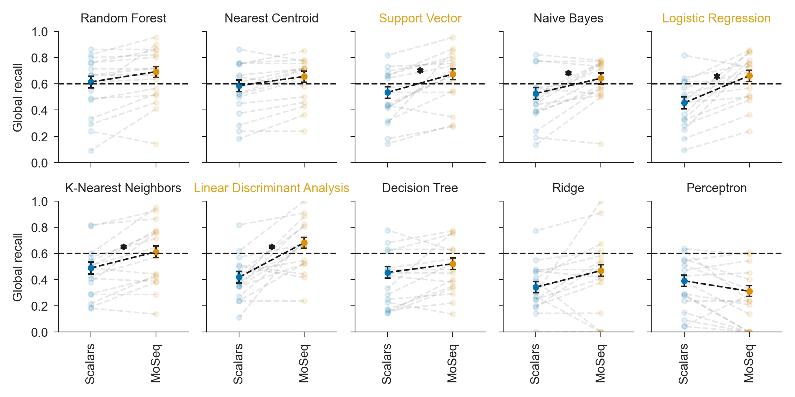
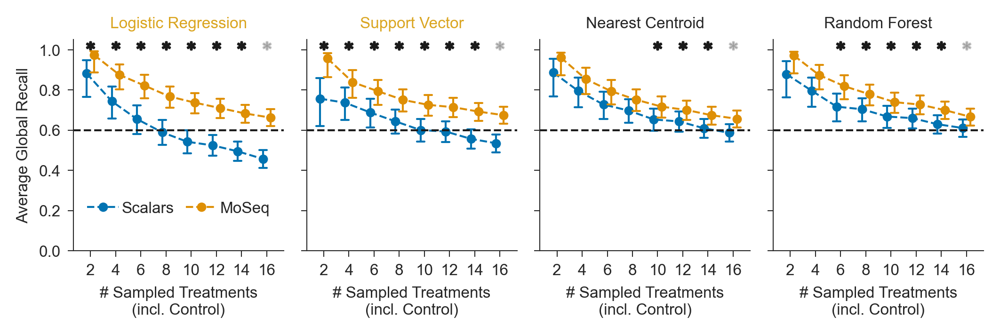

# MoSeq syllables share most information with scalar locomotion features

## Abstract
“Revealing the structure of pharmacobehavioral space through motion sequencing” by Wiltschko et al. (2020) has been highly influential in behavioral phenotyping research. In a cohort of nearly 700 mice, the authors demonstrated that Motion Sequencing (MoSeq) could distinguish behavioral effects across a large and diverse set of neuroactive and psychoactive compounds.
A central conclusion of the study is that MoSeq syllable features substantially outperform more traditional scalar behavioral features in treatment classification tasks. Although this comparison is not emphasized outside the Results section, the reported advantage corresponds to an increase in classification performance exceeding 50% relative to scalar feature representations.
While reproducing parts of the analysis using the publicly available dataset, we found that much of this apparent performance difference can be attributed to differences in preprocessing, classifier selection, and hyperparameter optimization. Under alternative, but comparably standard, analytical choices, the performance gap between scalar features and MoSeq syllables was reduced to approximately 11%. Furthermore, in our reanalysis, the performance advantage of MoSeq syllables became statistically significant primarily in highly dense pharmacobehavioral spaces.
These findings do not contradict the utility of MoSeq syllables. Rather, they suggest that the magnitude and generality of their advantage over simpler scalar features may depend strongly on analytical methodology and dataset structure. This distinction is practically relevant, as scalar feature approaches are substantially less computationally demanding and often easier to interpret biologically. Consequently, for laboratories with limited computational resources or for studies focused on specific treatment effects, conventional scalar representations may provide a competitive and more accessible alternative. Our findings highlight the importance of analytical standardization and reproducibility in comparative behavioral representation studies. 

## Related files
The preprint can be found at WIP.

The necessary data was kindly shared by Wiltschko et al. at https://doi.org/10.5281/zenodo.3951697.
The root_dir variable in each notebook needs to be changed to the location of the directory containing both this repository and the data subdirectory.